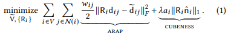
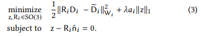

## Milestone

> Yifan Ren, Yang Heng

### What we’ve done so far

We have read this paper and learned some related technique. The most important technique is ADMM formulation, there are some details that still make us confuse. But a simple implemention can be acheived. 

We have run its official C++ code under linux and got some results, but we may change the framework of this project to fewer parts so that adding additional functions is easier.

We’re currently in a research phase with the Cubic Stylization. There’s a lot of code to understand, but we’re confident that we are close to understanding how it all fits together and how we can implement Cubic Stylization.

### Basic Process of Cubic Stylization

The goal is:

. R is a rotation matrix, and we must find such a optimal R which turns out to find a R* such that:

In eq(1), the first term is a typical ARAP-energy, while the second is not. The second term is the l-1 regularization term to show the cubeness of the mesh.

Because of the second second term we can't solve it the same as ARAP, but we can change it eq(1) to the following form and apply ADMM formulation:

Finally we adopt the local-global optimization strategy to obtain such a R*.

Here λ controls the level of cubeness. Although in eq(1) λ is the same for all meshes, but we can make some change so that diffirent parts of the object use different λ and present more artistic styles. This feature can be a main direction to generate new functions.

### Preliminary results

### Future Plan

Although we have run its code, many details are still not understandable for us.

We don't know how to add new functions to Scotty-3d right now, it requires us to understand the framework of the whole process.

We need to learn how to use libigl [Jacobson et al. 2018] to implement our method.

### Resources

> https://www.dgp.toronto.edu/projects/cubic-stylization/
> 
> https://web.stanford.edu/~boyd/papers/pdf/admm_distr_stats.pdf
> 
> https://www.dgp.toronto.edu/projects/paparazzi/
> 
> http://www.geometry.caltech.edu/pubs/HJSTBD13.pdf
