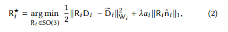

## Milestone

> Yifan Ren, Yang Heng

### Our Work

We have read this paper and learned some related technique. The most important technique is ARAP-energy, there are some details that still make us confuse. But a simple implemention can be acheived. 

We have run its official C++ code under linux and got some results, but we may change the framework of this project to fewer parts so that adding additional functions is easier.

### Basic Process

The goal is:

. R is a rotation matrix, \lambda, and we must find such a optimal R which turns out to find a R* such that:

It is a typical ADMM formulation and we solve it like this

### What We Confuse

Although we have run its code, many details are still not understandable 

### Results

### Resources

> https://www.dgp.toronto.edu/projects/cubic-stylization/
> 
